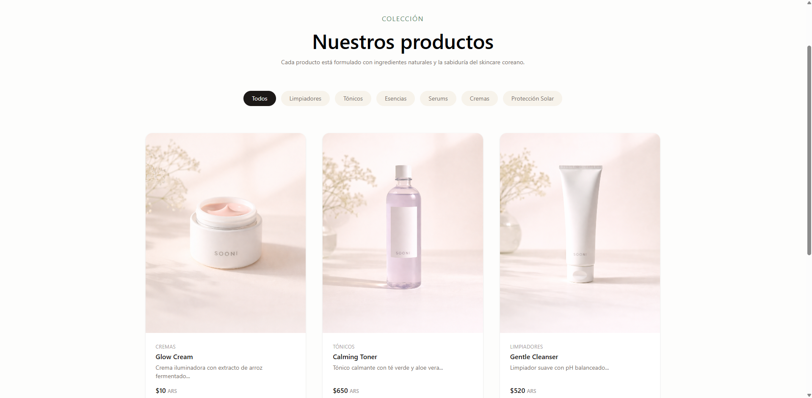
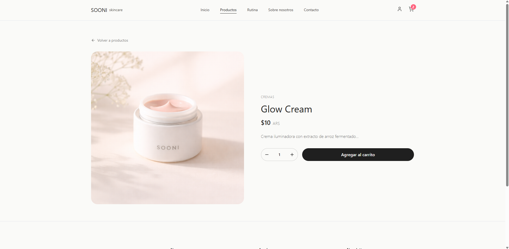
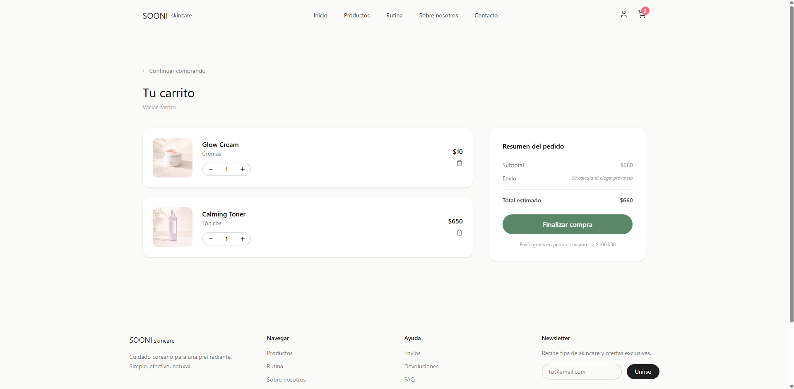
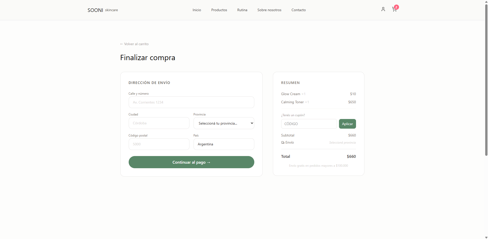
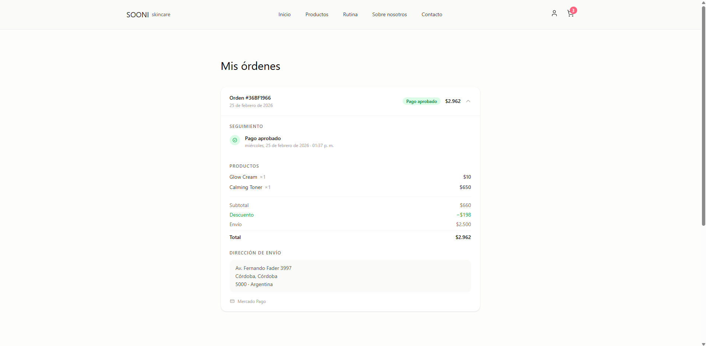
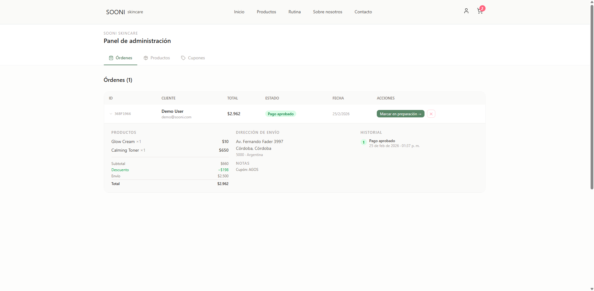
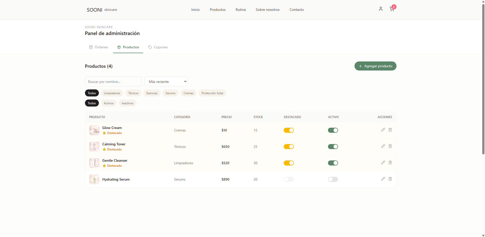
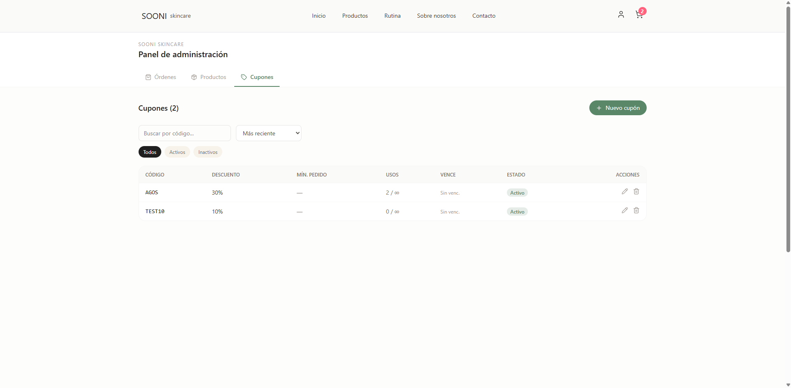
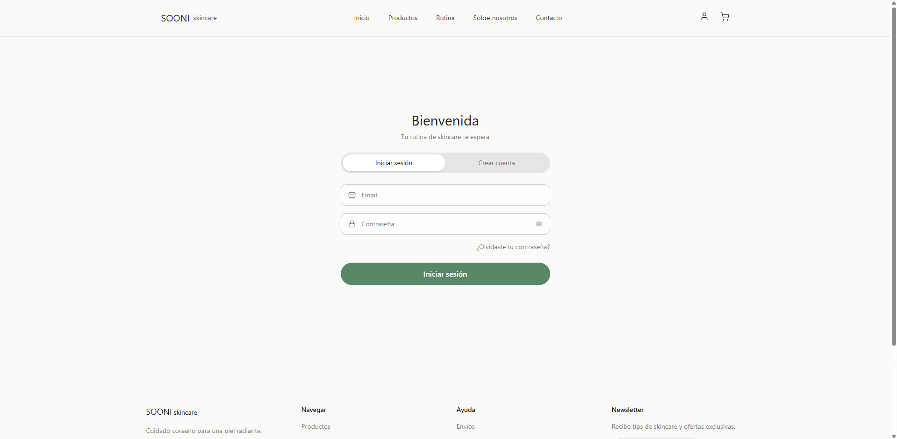

# SOONI Skincare — Korean Skincare E-commerce

> Tienda online de skincare coreano con panel de administración, carrito, pagos con MercadoPago y autenticación con Google.

<!-- Reemplazá la siguiente línea con una imagen de portada del proyecto -->


---

## Tabla de contenidos

- [Sobre el proyecto](#sobre-el-proyecto)
- [Capturas de pantalla](#capturas-de-pantalla)
- [Tecnologías](#tecnologías)
- [Estructura del proyecto](#estructura-del-proyecto)
- [Instalación y uso local](#instalación-y-uso-local)
- [Variables de entorno](#variables-de-entorno)
- [Seeds disponibles](#seeds-disponibles)
- [Roles de usuario](#roles-de-usuario)
- [API — Endpoints principales](#api--endpoints-principales)

---

## Sobre el proyecto

SOONI es una tienda de e-commerce construida con React + Node.js que permite:

- Explorar y filtrar productos de skincare coreano
- Gestionar un carrito de compras persistente
- Realizar pagos con **MercadoPago**
- Registrarse / iniciar sesión con email o **Google OAuth**
- Seguir el estado de los pedidos
- Administrar productos, órdenes y cupones desde un panel de admin

---

## Capturas de pantalla

<!-- Agregá tus capturas en la carpeta docs/images/ y actualizá los paths -->

### Home — Hero


### Catálogo de productos


### Detalle de producto


### Carrito


### Checkout


### Mis pedidos


### Panel de administración




### Login / Registro


---

## Tecnologías

### Frontend
| Tecnología | Uso |
|---|---|
| React 19 | UI |
| React Router v7 | Navegación |
| Tailwind CSS v4 | Estilos |
| Zustand | Estado global (auth) |
| Axios | Llamadas a la API |
| MercadoPago SDK React | Botón de pago |
| Google OAuth (`@react-oauth/google`) | Login social |
| Vite | Build tool |
| Lucide React | Iconos |

### Backend
| Tecnología | Uso |
|---|---|
| Node.js + Express 5 | Servidor REST |
| MongoDB + Mongoose | Base de datos |
| JSON Web Token | Autenticación |
| bcryptjs | Hash de contraseñas |
| MercadoPago SDK Node | Procesamiento de pagos |
| Multer | Upload de imágenes |
| dotenv | Variables de entorno |

---

## Estructura del proyecto

```
sooni-skincare-coreano/
├── backend/
│   ├── src/
│   │   ├── config/          # Conexión DB y MercadoPago
│   │   ├── controllers/     # Lógica de negocio
│   │   ├── middlewares/     # Auth, roles, errores
│   │   ├── models/          # Schemas Mongoose
│   │   ├── routes/          # Definición de rutas
│   │   ├── seed/            # Scripts de datos iniciales
│   │   ├── services/        # Servicio de MercadoPago
│   │   └── utils/
│   └── public/images/       # Imágenes de productos (subidas)
│
└── frontend/
    └── src/
        ├── components/      # Componentes reutilizables
        ├── context/         # CartContext
        ├── pages/           # Páginas de la app
        ├── router/          # Rutas protegidas
        ├── services/        # Capa de API (axios)
        ├── store/           # Zustand (auth)
        └── styles/
```

---

## Instalación y uso local

### Prerequisitos
- Node.js 18+
- Cuenta en MongoDB Atlas (o instancia local)
- Cuenta de MercadoPago Developers (para pagos de prueba)
- Credenciales de Google OAuth (opcional, para login social)

### 1. Clonar el repositorio

```bash
git clone https://github.com/tu-usuario/sooni-skincare-coreano.git
cd sooni-skincare-coreano
```

### 2. Configurar el backend

```bash
cd backend
cp .env.example .env
# Editá el .env con tus credenciales reales
npm install
```

### 3. Configurar el frontend

```bash
cd ../frontend
npm install
```

### 4. Cargar datos iniciales

```bash
cd backend

# Productos de ejemplo
npm run seed

# Usuarios
npm run seed:admin    # Admin con acceso completo
npm run seed:viewer   # Viewer (dashboard solo lectura)
npm run seed:demo     # Usuario demo (carrito y compras)
```

### 5. Levantar el proyecto

```bash
# Terminal 1 — Backend
cd backend && npm run dev

# Terminal 2 — Frontend
cd frontend && npm run dev
```

Abre [http://localhost:5173](http://localhost:5173)

---

## Variables de entorno

Copiá `backend/.env.example` a `backend/.env` y completá los valores:

```env
PORT=4000
MONGO_URI=mongodb+srv://<usuario>:<password>@cluster.mongodb.net/sooni

JWT_SECRET=tu_secreto_jwt

MERCADOPAGO_ACCESS_TOKEN=APP_USR-...

FRONTEND_URL=http://localhost:5173
BACKEND_URL=http://localhost:4000

# Seeds
ADMIN_EMAIL=admin@tudominio.com
ADMIN_PASSWORD=TuPasswordSegura!
ADMIN_NAME=Admin SOONI

VIEWER_EMAIL=viewer@tudominio.com
VIEWER_PASSWORD=TuPasswordSegura!
VIEWER_NAME=Viewer SOONI

DEMO_EMAIL=demo@tudominio.com
DEMO_PASSWORD=TuPasswordSegura!
DEMO_NAME=Demo User
```

> ⚠️ **Nunca subas el archivo `.env` a Git.** Ya está incluido en el `.gitignore`.

---

## Seeds disponibles

| Script | Rol creado | Acceso |
|---|---|---|
| `npm run seed` | — | Carga productos de ejemplo |
| `npm run seed:admin` | `admin` | Panel completo, CRUD de todo |
| `npm run seed:viewer` | `viewer` | Panel en modo solo lectura |
| `npm run seed:demo` | `demo` | Carrito y compras, sin editar cuenta |

---

## Roles de usuario

| Rol | Ver productos | Carrito / Compras | Dashboard admin | Editar productos / órdenes |
|---|:---:|:---:|:---:|:---:|
| `user` | ✅ | ✅ | ❌ | ❌ |
| `demo` | ✅ | ✅ | ❌ | ❌ |
| `viewer` | ✅ | ✅ | ✅ (solo lectura) | ❌ |
| `admin` | ✅ | ✅ | ✅ | ✅ |

---

## API — Endpoints principales

### Auth
| Método | Ruta | Acceso |
|---|---|---|
| POST | `/api/auth/register` | Público |
| POST | `/api/auth/login` | Público |
| POST | `/api/auth/google` | Público |
| GET | `/api/auth/profile` | Autenticado |

### Productos
| Método | Ruta | Acceso |
|---|---|---|
| GET | `/api/products` | Público |
| GET | `/api/products/:id` | Público |
| GET | `/api/products/admin` | Admin / Viewer |
| POST | `/api/products` | Admin |
| PUT | `/api/products/:id` | Admin |
| DELETE | `/api/products/:id` | Admin |

### Órdenes
| Método | Ruta | Acceso |
|---|---|---|
| GET | `/api/orders/user/me` | Autenticado |
| GET | `/api/orders` | Admin / Viewer |
| PUT | `/api/orders/:id/status` | Admin |

### Cupones
| Método | Ruta | Acceso |
|---|---|---|
| POST | `/api/coupons/apply` | Autenticado |
| GET | `/api/coupons` | Admin / Viewer |
| POST | `/api/coupons` | Admin |
| PUT | `/api/coupons/:id` | Admin |
| DELETE | `/api/coupons/:id` | Admin |

### Pagos
| Método | Ruta | Acceso |
|---|---|---|
| POST | `/api/payments/create-preference` | Autenticado |

---

## Licencia

MIT
